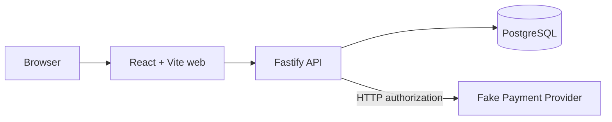
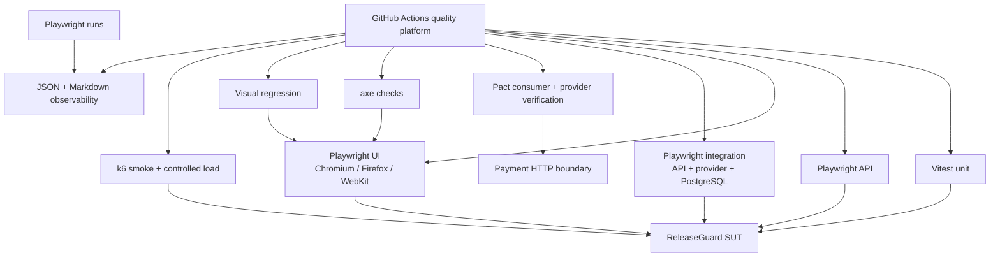
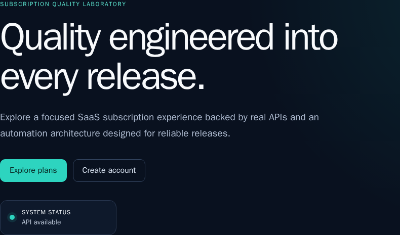
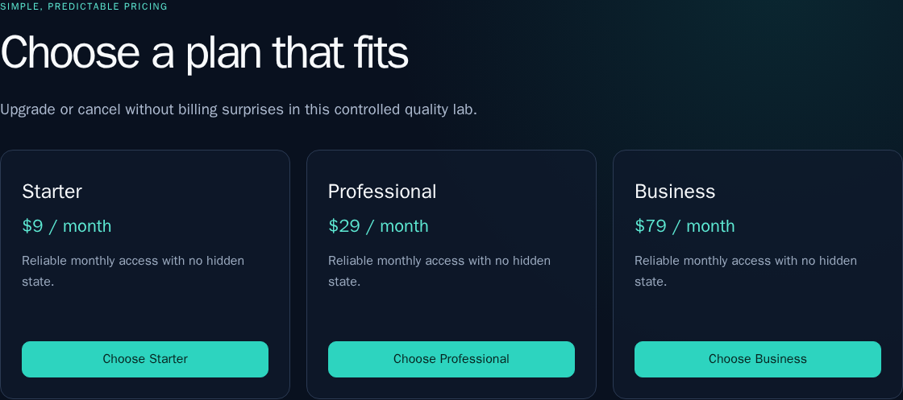

# ReleaseGuard

[](https://github.com/ldmrtnll-arch/releaseguard-sdet/actions/workflows/ci.yml)

ReleaseGuard is a self-contained SDET and Quality Engineering lab that tests a controlled SaaS subscription system across API, browser, database, service integration, consumer contracts, accessibility, visual regression, performance, and CI observability.

The application is intentionally compact. The portfolio subject is the quality architecture around it: deterministic data, meaningful layer boundaries, failure evidence, concurrency invariants, and quality gates that are strong enough to find regressions without making every pull request run every expensive experiment.

**Release status:** `v1.0.0` release candidate — unreleased.

## Why this project exists

Framework demos often stop after a happy-path browser test. ReleaseGuard instead provides an entirely controlled system under test so difficult quality problems can be exercised reproducibly: real PostgreSQL state, an HTTP payment boundary, concurrent writes, retries, timeouts, contract drift, browser differences, measured latency, and retry-aware test reporting.

## Quality Engineering highlights

- **Parallel-safe test data:** unique `.test` users and payment keys combine a run ID, worker index, and counter; mutable state is test-owned while plans are immutable reference data.
- **Concurrency invariant:** simultaneous subscription requests must produce one active subscription, one approved payment, and one provider authorization.
- **Deterministic fault injection:** the Payment Provider models approved, declined, server-error, transient, slow, and timeout behavior without random failures.
- **Retry and idempotency:** technical provider failures are retried with the same key; business declines are not retried.
- **Consumer-driven contracts:** Pact verifies the production payment client against a generated contract and replays it against the real fake provider.
- **API-first browser setup:** browser tests create preconditions through public APIs, then keep user-visible behavior in the browser.
- **Layered UI quality:** functional Playwright coverage is complemented by six automated axe checks and four selective visual baselines.
- **Measured performance gates:** a warmed, short PR smoke detects coarse regressions; the controlled 50-second load remains manual.
- **Test observability:** a repository-owned Playwright reporter preserves retry-pass results as flaky and produces sanitized JSON and Markdown evidence.
- **Cost-aware CI:** pull requests receive selective parallel gates; full cross-browser regression runs weekly or manually; controlled load is manual only.

## System under test

The React application supports registration, login, session restoration, public plan discovery, subscription creation, plan change, cancellation, re-subscription, and logout. A Fastify API owns the domain rules, PostgreSQL stores users, plans, subscriptions, and payments, and an independent Fastify Payment Provider supplies a real HTTP integration boundary with deterministic test controls.



Test controls are disabled when the API runs in production mode. The provider is a controlled test dependency, not a real gateway or financial system.

## Quality architecture



## Test layers

| Layer            | Tool                       | What it validates                                                                     |
| ---------------- | -------------------------- | ------------------------------------------------------------------------------------- |
| Unit             | Vitest                     | Builders, configuration safeguards, retry classification, and observability logic     |
| Provider API     | Playwright request context | Provider validation, deterministic failures, idempotency, and concurrency             |
| ReleaseGuard API | Playwright request context | Auth, plans, subscription rules, ownership, errors, and lifecycle                     |
| Integration      | Playwright + PostgreSQL    | Real service calls, persistence, timeout/retry behavior, and double-charge prevention |
| Contract         | Pact JS                    | Three consumer expectations and provider compatibility at the payment boundary        |
| UI               | Playwright                 | Real user journeys in Chromium, Firefox, and WebKit                                   |
| Accessibility    | axe + Playwright           | Automated WCAG-tagged checks on six critical rendered states                          |
| Visual           | Playwright snapshots       | Four intentionally selected Linux-rendered regions                                    |
| Performance      | k6 2.2.0                   | Correctness and latency for reads, login, and subscription writes                     |

The default `npm test` suite currently contains 111 logical tests: 24 unit, 10 provider, 34 API, 12 integration, three Pact consumer tests, one provider-verification test, 21 Chromium UI tests, and six accessibility scans. The four visual comparisons and secondary/full-browser executions are reported separately so repeated executions are not presented as new test cases.

## Key engineering scenarios

Two concurrent subscription requests deliberately race for the same user. A transaction-level advisory lock and a partial unique index ensure the outcome is one active subscription and one logical payment rather than a double charge.

The Payment Provider makes failures controllable instead of random. Integration tests prove which failures should retry, that retries preserve an idempotency key, that declines do not retry, and that failed or timed-out authorization does not create local state. An external HTTP result and a PostgreSQL commit are not a distributed transaction; reconciliation after an unknown external outcome remains an explicit limitation.

## Tech stack

TypeScript, Node.js 22+, npm workspaces, React 19, Vite 7, Fastify 5, PostgreSQL 17, Playwright 1.62.1, Vitest 4, Pact JS, axe-core, k6 2.2.0, Docker Compose, and GitHub Actions.

## Repository structure

```text
apps/
  api/                 Fastify API, domain services, repositories, migrations
  payment-provider/    deterministic external-service fake
  web/                 React application and production Nginx image
packages/
  test-data/           parallel-safe builders
  test-observability/  Playwright reporter, analyzer, and renderers
tests/
  unit/ api/ provider/ integration/ contract/ ui/ accessibility/ visual/ performance/
docs/                  architecture and layer-specific guides
scripts/               k6 and deterministic visual runners
.github/workflows/      PR, extended-regression, and manual-load workflows
```

## Quick start

Requirements: Node.js 22 or newer, npm, and Docker with Compose. From a clean clone:

```powershell
npm ci
docker compose up --build -d
docker compose ps
```

Open `http://localhost:5173`. Compose starts PostgreSQL, applies migrations `001`–`004`, and waits for healthy provider, API, and web services. Configuration defaults are artificial and local-only; copy `.env.example` to `.env` only when overrides are needed (`Copy-Item .env.example .env` in PowerShell or `cp .env.example .env` in a POSIX shell).

For host-based browser development, install the engines once with `npx playwright install chromium firefox webkit`, start PostgreSQL with `docker compose up -d postgres`, apply `npm run db:migrate`, and run `npm run dev`.

## Running tests

Database-backed commands require PostgreSQL; the simplest preparation is `docker compose up -d postgres`. Playwright starts or reuses the application services and waits on health URLs—no sleep-based readiness is used.

| Command                         | Purpose                                                  |
| ------------------------------- | -------------------------------------------------------- |
| `npm test`                      | 111-test standard regression                             |
| `npm run test:unit`             | Fast unit/tooling checks                                 |
| `npm run test:provider`         | Payment Provider API suite                               |
| `npm run test:api`              | ReleaseGuard API suite                                   |
| `npm run test:integration`      | Provider/PostgreSQL integration suite                    |
| `npm run test:contract`         | Generate three Pact interactions and verify the provider |
| `npm run test:ui`               | Full Chromium UI suite                                   |
| `npm run test:ui:cross-browser` | Four smoke journeys in Chromium, Firefox, and WebKit     |
| `npm run test:ui:firefox:full`  | Full Firefox UI suite                                    |
| `npm run test:ui:webkit:full`   | Full WebKit UI suite                                     |
| `npm run test:a11y`             | Six automated axe checks                                 |
| `npm run test:visual`           | Four visual comparisons in pinned Linux Chromium         |
| `npm run test:visual:update`    | Deliberately regenerate reviewed Linux baselines         |
| `npm run test:perf:smoke`       | Warmed, bounded Docker/k6 regression gate                |
| `npm run test:perf:load`        | Manual 50-second controlled-load profile                 |
| `npm run test:analyze`          | Validate the latest Playwright JSON and render Markdown  |

Never update visual baselines automatically in CI. Performance commands use the pinned k6 image and sanitize summaries before they can become artifacts.

## Quality platform and CI

Every pull request runs eight independently useful checks: Quality, API and integration, Contract, Chromium UI, Firefox UI smoke, WebKit UI smoke, Advanced quality, and Performance smoke. Playwright jobs always publish sanitized observability summaries; rich reports, traces, screenshots, and video are retained only on failure. k6 publication is fail-closed: if summary sanitization fails, the raw file is deleted and no artifact is uploaded.

The weekly/manual extended workflow runs all 21 UI tests separately in Chromium, Firefox, and WebKit. Controlled load stays outside pull requests. See [CI Quality Platform](docs/ci-quality-platform.md) for triggers, check names, evidence, and failure investigation.

## Test observability

The custom reporter records stable IDs, logical results, every attempt, retries, flaky classification, duration percentiles, tags, and probable failure categories. It produces repository-relative, credential-redacted JSON under `test-observability-results/`; `npm run test:analyze` creates the companion Markdown and GitHub Step Summary. It observes Playwright projects only—Vitest, Pact, and k6 keep their native reporting paths.

## Performance engineering

ReleaseGuard follows **measure → derive thresholds → gate coarse regressions**. The PR smoke explicitly warms readiness, PostgreSQL-backed reads, authenticated reads, and the subscription/provider path without contaminating custom latency trends. It uses 12 plans reads, 12 authenticated reads, four logins, and five subscription writes in short scheduled windows.

The existing controlled local baseline reached 31.20 requests/second with zero errors under a 12-VU peak. This is local/containerized regression context, not production capacity; VUs do not equal real users. Full methodology and thresholds are in [Performance Testing](docs/performance-testing.md).

## Portfolio snapshots

These images are the real version-controlled visual regression baselines, rendered in the pinned Linux environment.





## Documentation

| Document                                               | Focus                                                       |
| ------------------------------------------------------ | ----------------------------------------------------------- |
| [Architecture](docs/architecture.md)                   | Runtime, data, quality, and operational boundaries          |
| [Test strategy](docs/test-strategy.md)                 | Layer ownership, selection, and release signals             |
| [Test data](docs/test-data.md)                         | Isolation, builders, reference data, and performance users  |
| [API testing](docs/api-testing.md)                     | API clients, contracts, errors, persistence, and security   |
| [UI testing](docs/ui-testing.md)                       | Journeys, fixtures, Page Objects, and browsers              |
| [Integration testing](docs/integration-testing.md)     | Payment behavior, idempotency, concurrency, and consistency |
| [Contract testing](docs/contract-testing.md)           | Pact consumer/provider roles and limitations                |
| [Accessibility testing](docs/accessibility-testing.md) | Automated axe scope and manual gaps                         |
| [Visual testing](docs/visual-testing.md)               | Baseline policy and deterministic execution                 |
| [Performance testing](docs/performance-testing.md)     | Baseline, workload, thresholds, and safe artifacts          |
| [Test observability](docs/test-observability.md)       | Schema, reporter, sanitizer, and analyzer                   |
| [CI quality platform](docs/ci-quality-platform.md)     | PR gates, extended workflows, and artifacts                 |
| [Interview demo](docs/demo.md)                         | A focused 5–10 minute walkthrough                           |
| [v1.0.0 release notes](docs/releases/v1.0.0.md)        | Release-candidate scope and limitations                     |
| [Release checklist](docs/release-checklist.md)         | Manual publication gates                                    |

## Demo

The [interview demo guide](docs/demo.md) starts the stack, demonstrates the critical browser lifecycle, and then uses focused integration, concurrency, Pact, observability, and CI evidence to explain the engineering decisions in 5–10 minutes.

## Engineering decisions and trade-offs

- A local fake provider gives deterministic failure control without coupling the portfolio to an external sandbox.
- API-first UI setup reduces browser cost without bypassing the UI behavior under test.
- Direct database assertions are selective and read-only; public API behavior remains the primary contract.
- Contract tests protect boundary compatibility, while integration tests prove the real services operate together.
- Visual coverage protects four high-signal regions instead of snapshotting every page.
- PR performance smoke favors stable coarse detection; controlled load preserves the measured benchmark.
- Observability is intentionally Playwright-scoped and does not pretend to be a historical analytics platform.

## Known limitations

- This is a controlled local SUT, not a deployed or production-ready financial platform.
- There is no real payment gateway, PCI claim, Pact Broker, distributed load generation, or observability database.
- Payment authorization and the local database transaction cannot provide exactly-once distributed guarantees.
- Automated axe checks do not establish complete WCAG conformance; manual accessibility review is still required.
- Performance results are environment-specific and do not establish production capacity.
- The release candidate is prepared but has not been tagged or published.

The planned v1 engineering roadmap is complete. Future product expansion is intentionally outside this portfolio release.
