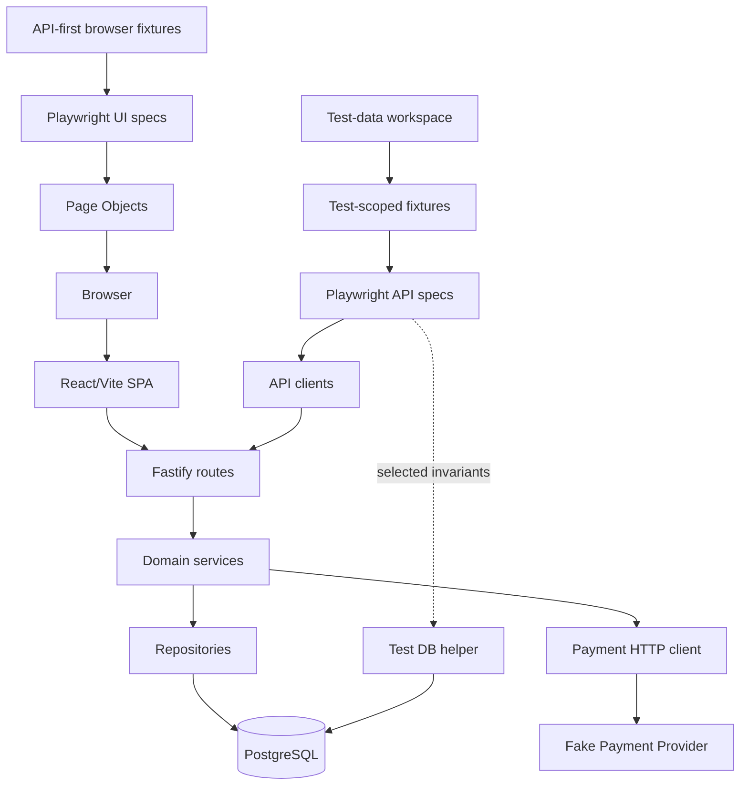
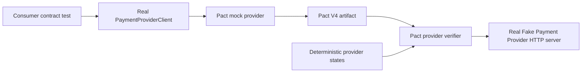
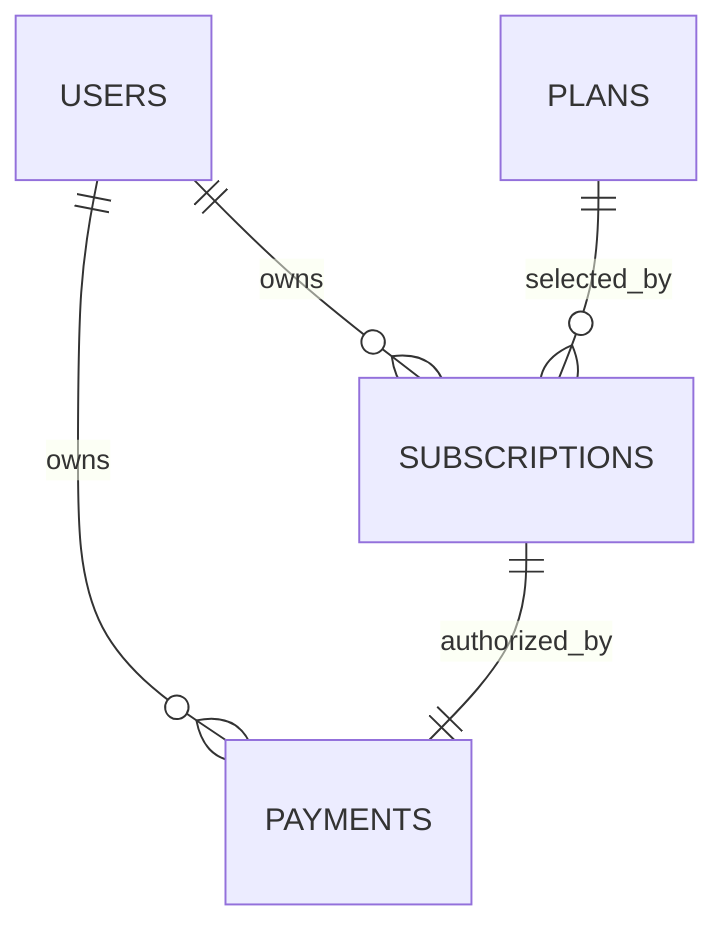
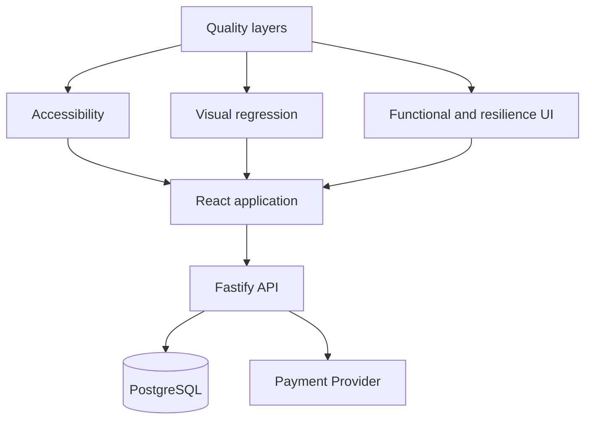
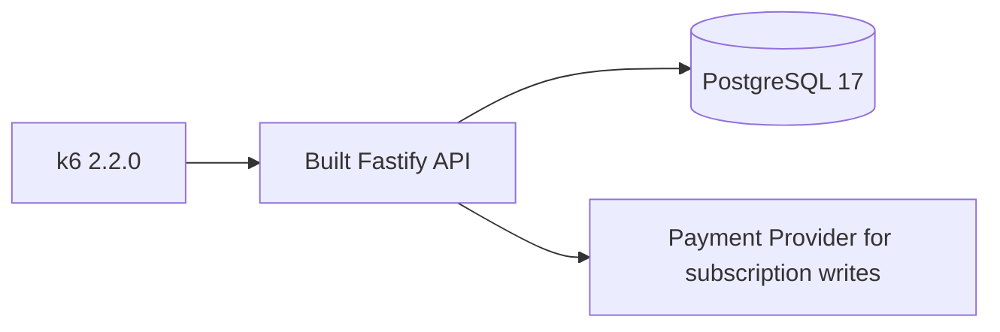
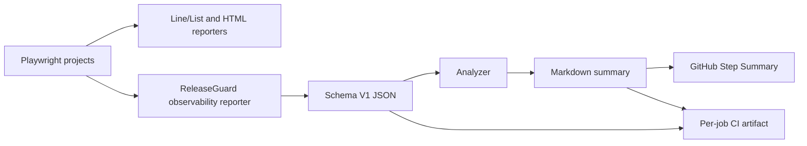

# Phase 9 Architecture

ReleaseGuard keeps business behavior separate from transport and persistence while remaining intentionally small.

The runtime path above remains unchanged. Contract testing adds an independent verification path:

Advanced quality targets the rendered application through three deliberately small browser layers:

Performance testing adds a service-level path that does not involve the browser or Vite development server:

Test observability is a read-only test infrastructure path and does not enter the product runtime:

The reporter derives repository-relative identity and consumes final Playwright results after all retries. It does not intercept application traffic, mutate tests, or aggregate separate jobs. The pure analyzer and Markdown renderer are independently unit tested; GitHub publishing remains a thin cross-platform Node CLI.

## Application boundaries

- React Router owns the five public/protected routes and Nginx provides the production SPA fallback.
- `AuthProvider` keeps the short-lived browser session in `sessionStorage` and validates restoration through `/me`.
- The web API client centralizes transport errors while pages own loading, error, and lifecycle presentation.

- Auth routes and service preserve registration, login, JWT verification, bcrypt hashing, and public-user serialization.
- Plan routes expose public reads. `PlanRepository` owns deterministic active-plan queries and explicit price ordering.
- Subscription routes parse strict input, derive ownership from JWT, and delegate rules to `SubscriptionService`.
- `SubscriptionService` owns plan eligibility, current-state checks, same-plan conflicts, cancellation, and re-subscription behavior.
- For creation, `SubscriptionService` uses the plan's stored USD price, a user-scoped advisory lock, and the payment client before atomically persisting the subscription and payment.
- The payment client owns the 250 ms per-attempt timeout, maximum of two attempts, technical-only retry policy, stable idempotency key, and request-ID propagation.
- The independent fake provider owns deterministic failure scenarios, payload validation, idempotent replay/conflict behavior, and a read-only test inspection surface.
- `SubscriptionRepository` owns parameterized SQL and maps the active-subscription unique-index conflict to a stable domain error.
- PostgreSQL is the final authority for foreign keys, valid states, cancellation consistency, and one active subscription per user.

Subscription reads use a join with plan data, avoiding N+1 requests and exposing a useful public aggregate.

## Data lifecycle

Migrations remain explicit, ordered, transactional, and protected by the existing PostgreSQL advisory lock. `002_create_plans.sql` creates and seeds deterministic reference data. `003_create_subscriptions.sql` creates lifecycle records. `004_create_payments.sql` records approved authorizations with unique provider, subscription, and idempotency references. Docker and CI use the existing migration entrypoint before starting or testing the API.

Foreign keys use restrictive deletion behavior because users, plans, and subscription history must not be removed implicitly.

## Test boundaries

- API clients centralize paths and Authorization headers but never assert or throw on HTTP error status.
- Test-scoped fixtures create authenticated and subscribed state only when a test needs it.
- The user builder stays worker-scoped and keeps `workerIndex` from Phase 2.
- Zod schemas validate only important public response fields.
- Direct database access is read-only and limited to invariants the public API cannot prove efficiently.
- UI setup uses API clients for authenticated or subscribed preconditions; business behavior under test remains browser-driven.
- Page Objects contain reusable interactions and locators, while assertions stay in specs.
- Consumer contract tests execute the production `PaymentProviderClient` against a Pact-managed mock server and describe only fields and headers the consumer relies on.
- Provider verification replays the generated Pact against a real Fastify HTTP listener. Named state handlers select deterministic fake-provider behavior without exposing Pact controls through the application API.
- Pact artifacts are generated, ignored by Git, verified in the same run, and uploaded by CI for diagnosis. The monorepo does not require a broker in this phase.
- Contract tests protect boundary compatibility; integration tests continue to prove that the API, provider, and PostgreSQL operate together at runtime.
- Accessibility scans inspect six critical anonymous/authenticated states with WCAG-tagged axe rules; visual tests compare four selected regions in a pinned Linux browser environment.
- User-facing resilience uses real API/provider failures for payment and session behavior. Network interception is reserved for deterministic rendering of otherwise destructive availability failures.
- k6 owns run-scoped performance users and endpoint metrics. Read/auth load reaches the built API and PostgreSQL; the bounded subscription-write smoke also crosses the real provider boundary.
- The observability reporter records Playwright logical tests and attempts while the standard HTML reporter retains detailed evidence. Vitest, Pact, and k6 keep their native result paths.
- Stable observability IDs depend on relative file, project, suite/title, and repeat index. Only safe `request-id` annotations are accepted for optional correlation; no new product protocol is introduced.

## Operational boundaries

Health, readiness, structured logging, request IDs, secret redaction, Docker health checks, and graceful shutdown remain unchanged. Playwright launches direct non-watch API and Vite processes so Windows test runs release ports reliably between commands. Reporter writes are atomic, remain inside the repository, and redact credential-shaped error content; generated observability output is ignored by Git.

The local database transaction cannot include the provider's HTTP operation. After an exhausted timeout, local rows are rolled back while the external result may remain unknown; reconciliation is intentionally deferred. Performance execution uses a separate Compose profile, so the normal application stack never starts load generation implicitly.
