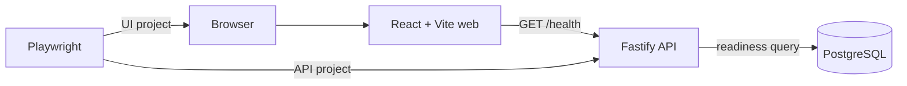

# Phase 1 Architecture

ReleaseGuard is a controlled system under test. Phase 1 intentionally implements only the components needed to establish a credible development and testing foundation.

## Boundaries

- `apps/api` owns HTTP bootstrapping, environment validation, routes, and the PostgreSQL connection boundary. App construction is separate from process startup so later tests can use Fastify injection without opening a port.
- `apps/web` owns the accessible application shell and its single health integration.
- `tests/api` and `tests/ui` separate protocols while sharing Playwright's runner, lifecycle, and diagnostics.
- `compose.yaml` provides a reproducible local stack. The default test workflow starts only PostgreSQL in Docker and lets Playwright own short-lived application processes.

No database tables exist yet because Phase 1 has no persisted domain concept. PostgreSQL is exercised by readiness, without adding a fictitious model. Schema migrations will begin with real authentication entities in Phase 2.

## Operational signals

Fastify emits structured JSON logs and accepts `X-Request-ID` as its request identifier. Liveness does not depend on PostgreSQL; readiness does. Errors returned by readiness use a stable code and do not expose internal stack traces.

## Future boundary

Authentication, subscription behavior, a fake payment provider, contracts, and performance tooling belong to later phases. They are omitted here to keep the initial architecture honest and small.
