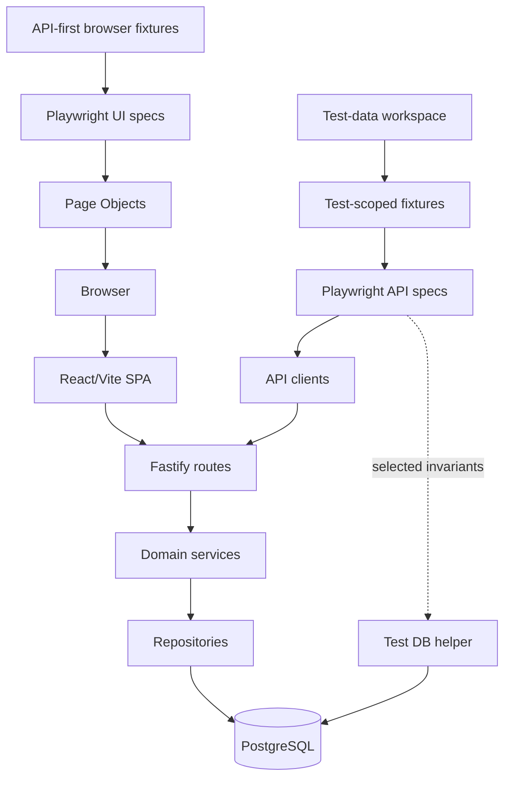
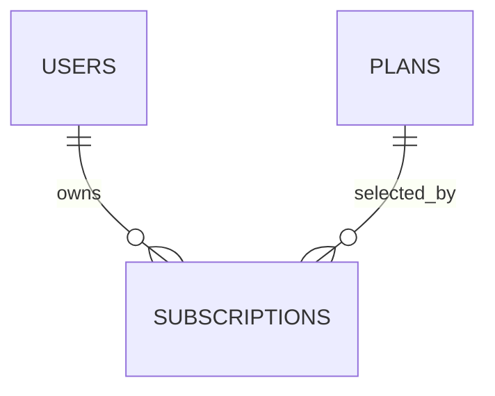

# Phase 4 Architecture

ReleaseGuard keeps business behavior separate from transport and persistence while remaining intentionally small.

## Application boundaries

- React Router owns the five public/protected routes and Nginx provides the production SPA fallback.
- `AuthProvider` keeps the short-lived browser session in `sessionStorage` and validates restoration through `/me`.
- The web API client centralizes transport errors while pages own loading, error, and lifecycle presentation.

- Auth routes and service preserve registration, login, JWT verification, bcrypt hashing, and public-user serialization.
- Plan routes expose public reads. `PlanRepository` owns deterministic active-plan queries and explicit price ordering.
- Subscription routes parse strict input, derive ownership from JWT, and delegate rules to `SubscriptionService`.
- `SubscriptionService` owns plan eligibility, current-state checks, same-plan conflicts, cancellation, and re-subscription behavior.
- `SubscriptionRepository` owns parameterized SQL and maps the active-subscription unique-index conflict to a stable domain error.
- PostgreSQL is the final authority for foreign keys, valid states, cancellation consistency, and one active subscription per user.

Subscription reads use a join with plan data, avoiding N+1 requests and exposing a useful public aggregate.

## Data lifecycle

Migrations remain explicit, ordered, transactional, and protected by the existing PostgreSQL advisory lock. `002_create_plans.sql` creates and seeds deterministic reference data. `003_create_subscriptions.sql` creates the mutable lifecycle records and constraints. Docker and CI use the existing migration entrypoint before starting or testing the API.

Foreign keys use restrictive deletion behavior because users, plans, and subscription history must not be removed implicitly.

## Test boundaries

- API clients centralize paths and Authorization headers but never assert or throw on HTTP error status.
- Test-scoped fixtures create authenticated and subscribed state only when a test needs it.
- The user builder stays worker-scoped and keeps `workerIndex` from Phase 2.
- Zod schemas validate only important public response fields.
- Direct database access is read-only and limited to invariants the public API cannot prove efficiently.
- UI setup uses API clients for authenticated or subscribed preconditions; business behavior under test remains browser-driven.
- Page Objects contain reusable interactions and locators, while assertions stay in specs.

## Operational boundaries

Health, readiness, structured logging, request IDs, secret redaction, Docker health checks, and graceful shutdown remain unchanged. Playwright launches direct non-watch API and Vite processes so Windows test runs release ports reliably between commands.

Payments, invoices, and later quality layers remain outside Phase 4.
