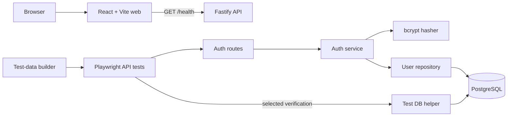

# Phase 2 Architecture

ReleaseGuard remains a controlled system under test. Phase 2 extends the small Phase 1 foundation with the first persisted domain and reusable test-data infrastructure.

## Application boundaries

- `apps/api/src/auth/routes.ts` owns HTTP parsing, status codes, JWT issuance, and authentication guards.
- `auth-service.ts` owns registration, normalization, password hashing, credential verification, and public-user conversion.
- `user-repository.ts` is the single SQL boundary for users and translates unique-constraint violations into a domain error.
- `migrations/` owns versioned schema changes. The runner records applied files and uses a PostgreSQL advisory transaction lock.
- `app.ts` assembles dependencies and registers the error model before route plugins so every route inherits it.

App creation remains separate from process startup. Health behavior, structured logging, `X-Request-ID`, CORS, and graceful shutdown from Phase 1 remain intact.

## Test boundaries

- `packages/test-data` is runner-independent and owns only synthetic-data construction.
- `tests/support/api` performs HTTP operations and parses selected critical contracts; it contains no assertions.
- `tests/support/fixtures.ts` composes an API client, worker-scoped builder, authenticated user, and minimal database helper.
- `tests/api` verifies public HTTP behavior; `tests/integration` uses direct database access only where persistence adds distinct confidence.

## Migration lifecycle

Local npm development runs `npm run db:migrate` explicitly. Docker Compose uses a single-purpose migration service that completes before the API starts. GitHub Actions applies migrations once before quality gates. This avoids hiding schema changes in application startup and avoids concurrent migrations from application replicas.

## Security and observability

Passwords are stored only as salted bcrypt hashes. JWTs contain only `sub`; passwords and Authorization headers are configured as Pino redaction paths. Expected domain errors use stable public codes. Unexpected errors are logged with the request ID while clients receive a generic response.

Subscription, plans, invoices, payment-provider, Pact, k6, accessibility, and visual tooling remain future boundaries.
